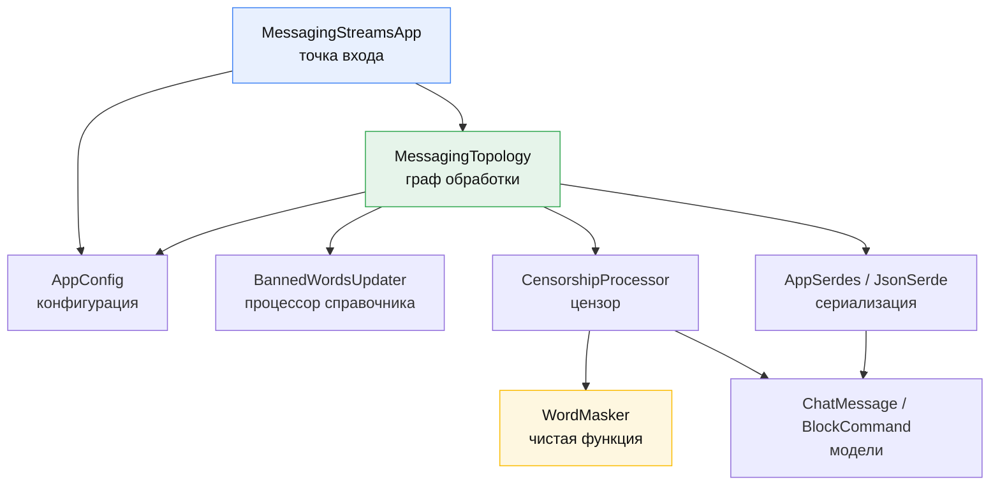
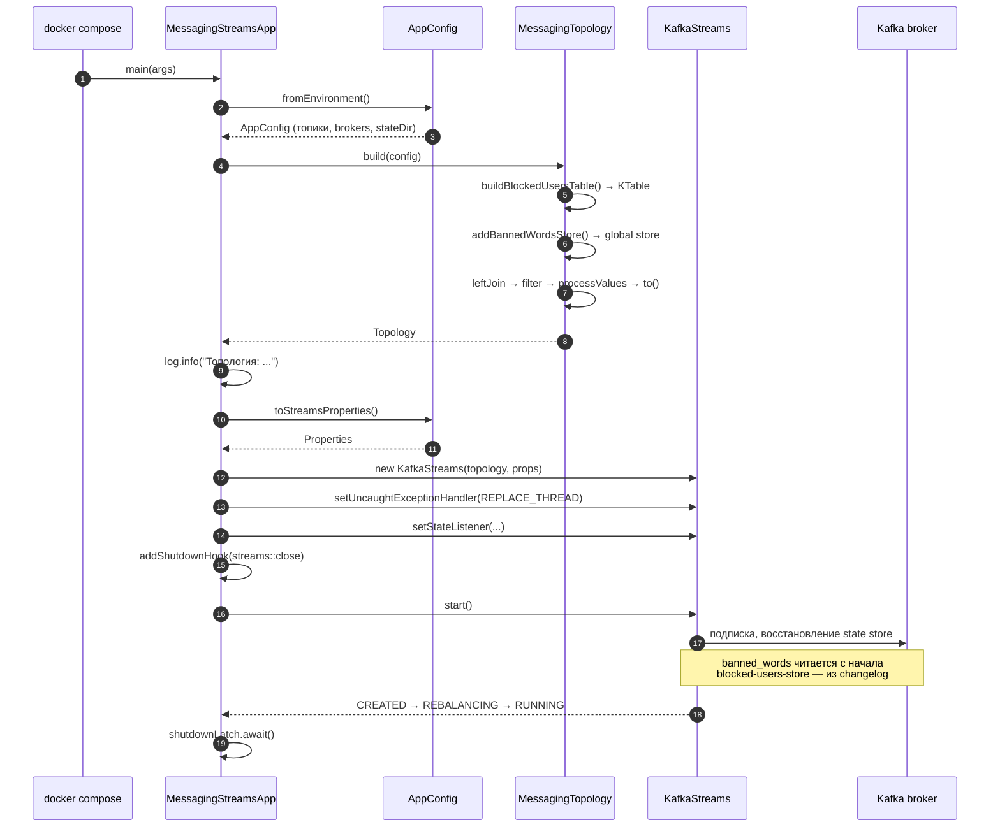
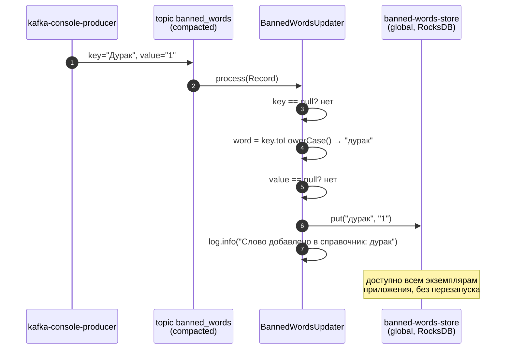
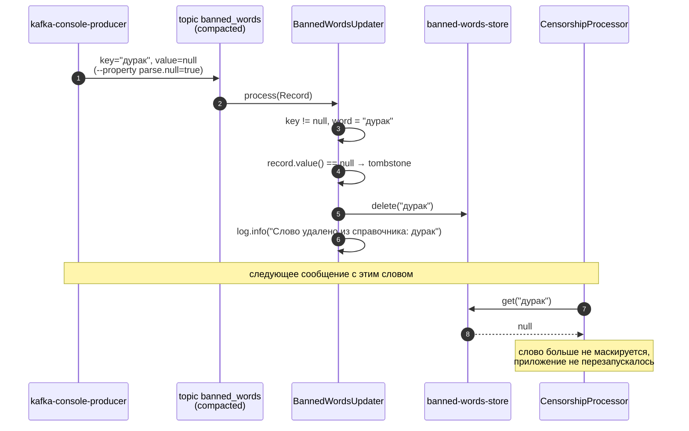
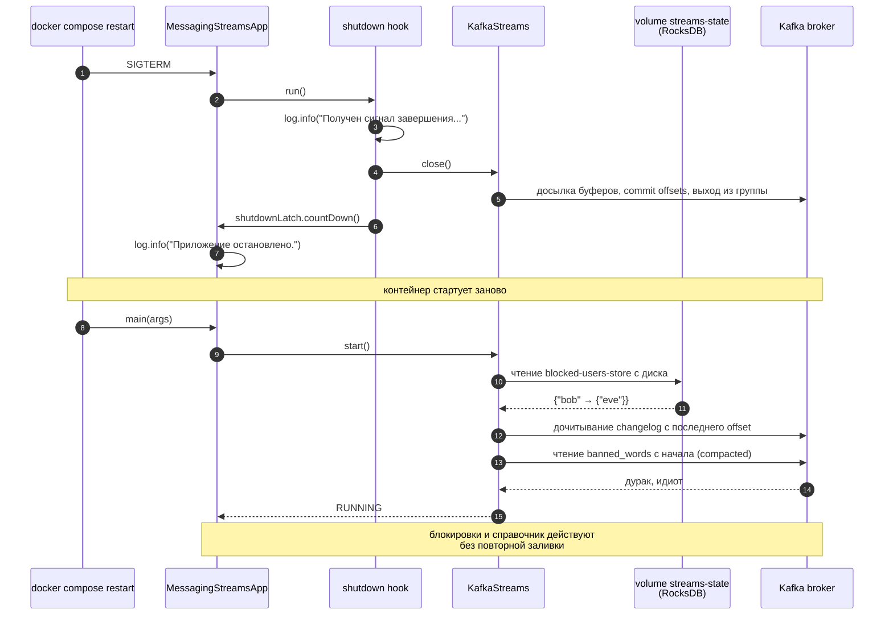

# Структура проекта и поток обработки

Разбор кодовой базы: какие файлы за что отвечают, что делает каждый класс и метод,
и как требования задания превращаются в конкретные вызовы.

Запуск — в [QUICKSTART.md](QUICKSTART.md). Обоснование архитектурных решений
(«почему leftJoin», «почему глобальное хранилище») — в [README.md](README.md).
Термины — в [глоссарии модуля](../../blob/main/glossary.md).

## Содержание

- [Карта файлов](#карта-файлов)
- [Слои и зависимости](#слои-и-зависимости)
- [Классы и методы](#классы-и-методы)
  - [MessagingStreamsApp](#messagingstreamsapp)
  - [AppConfig](#appconfig)
  - [MessagingTopology](#messagingtopology)
  - [BannedWordsUpdater](#bannedwordsupdater)
  - [CensorshipProcessor](#censorshipprocessor)
  - [WordMasker](#wordmasker)
  - [ChatMessage](#chatmessage)
  - [BlockCommand](#blockcommand)
  - [JsonSerde](#jsonserde)
  - [AppSerdes](#appserdes)
- [Sequence-диаграммы](#sequence-диаграммы)
  - [Старт приложения](#1-старт-приложения)
  - [Обновление справочника слов](#2-обновление-справочника-слов)
  - [Команда блокировки](#3-команда-блокировки)
  - [Главный поток: обработка сообщения](#4-главный-поток-обработка-сообщения)
  - [Сообщение от заблокированного отправителя](#5-сообщение-от-заблокированного-отправителя)
  - [Удаление слова через tombstone](#6-удаление-слова-через-tombstone)
  - [Битый JSON](#7-битый-json)
  - [Перезапуск и восстановление состояния](#8-перезапуск-и-восстановление-состояния)
- [Привязка требований задания к коду](#привязка-требований-задания-к-коду)
- [Состояние: где что лежит](#состояние-где-что-лежит)
- [Тесты](#тесты)

---

## Карта файлов

```
practicum-java/
├── docker-compose.yml                     стенд: Kafka (KRaft), приложение, ksqlDB, Kafka UI
├── ksqldb-queries.sql                     задание 2: поток + три таблицы аналитики
├── QUICKSTART.md                          пошаговый запуск
├── README.md                              архитектура и обоснование решений
├── ARCHITECTURE.md                        этот документ
├── test-data/
│   ├── messages.jsonl                     5 сообщений, ключ = recipient_id
│   ├── blocked_users.jsonl                1 команда: bob блокирует eve
│   └── banned_words.txt                   2 слова: дурак, идиот
└── src/
    ├── build.gradle.kts                   Java 21, kafka-streams 3.7.0, Jackson, Logback
    ├── settings.gradle.kts                rootProject.name = practicum-messaging-streams
    ├── Dockerfile                         многоступенчатая сборка: gradle:8.7-jdk21 → temurin:21-jre
    ├── main/
    │   ├── java/ru/practicum/kafka/streams/
    │   │   ├── MessagingStreamsApp.java   точка входа, жизненный цикл KafkaStreams
    │   │   ├── config/
    │   │   │   └── AppConfig.java         конфигурация из переменных окружения
    │   │   ├── model/
    │   │   │   ├── ChatMessage.java       сообщение чата
    │   │   │   └── BlockCommand.java      команда block/unblock
    │   │   ├── serde/
    │   │   │   ├── JsonSerde.java         универсальная JSON-сериализация
    │   │   │   └── AppSerdes.java         фабрика готовых Serde
    │   │   ├── topology/
    │   │   │   ├── MessagingTopology.java граф обработки целиком
    │   │   │   ├── BannedWordsUpdater.java процессор глобального хранилища
    │   │   │   └── CensorshipProcessor.java цензор текста
    │   │   └── util/
    │   │       └── WordMasker.java        чистая функция маскирования
    │   └── resources/
    │       └── logback.xml                настройка логирования
    └── test/java/ru/practicum/kafka/streams/
        ├── topology/MessagingTopologyTest.java   6 тестов через TopologyTestDriver
        └── util/WordMaskerTest.java              5 тестов маскирования
```

> **Нестандартная раскладка Gradle.** Корень Gradle-проекта — сама папка `src/`,
> поэтому исходники лежат в `src/main/java`, а не в `src/src/main/java`. Это задано
> явно в `build.gradle.kts` через `sourceSets`.

---

## Слои и зависимости



Зависимости направлены в одну сторону, циклов нет. `WordMasker` не зависит ни от
чего из Kafka — поэтому проверяется обычным юнит-тестом.

---

## Классы и методы

### MessagingStreamsApp

`ru.practicum.kafka.streams.MessagingStreamsApp` — точка входа. Вся логика
обработки вынесена в топологию, здесь только жизненный цикл.

| Метод | Сигнатура | Что делает |
|---|---|---|
| `main` | `static void main(String[] args)` | Читает конфигурацию, строит топологию, запускает `KafkaStreams` и блокируется до сигнала завершения. |

Что происходит внутри `main` по шагам:

1. `AppConfig.fromEnvironment()` — конфигурация из переменных окружения.
2. `MessagingTopology.build(config)` — построение графа.
3. `log.info("Топология:\n{}", topology.describe())` — печать фактического плана
   выполнения: источники, узлы, хранилища, стоки. По этому выводу видно, вставил
   ли Kafka Streams repartition-топик.
4. `setUncaughtExceptionHandler` → `REPLACE_THREAD` — необработанное исключение
   заменяет поток обработки новым, приложение продолжает работать.
5. `setStateListener` — лог перехода состояний (`CREATED → REBALANCING → RUNNING`).
6. `addShutdownHook` — на `SIGTERM` от `docker stop` вызывается `streams.close()`:
   досылает буферы, коммитит смещения, выходит из группы. Без этого партиции
   освободились бы только по таймауту сессии.
7. `streams.start()` и `shutdownLatch.await()` — main-поток ждёт, обработка идёт
   в потоках Kafka Streams.

`CountDownLatch` нужен, потому что `streams.start()` не блокирует: без ожидания
`main` завершился бы сразу после старта.

### AppConfig

`ru.practicum.kafka.streams.config.AppConfig` — **record** с семью полями:
`bootstrapServers`, `applicationId`, `stateDir`, `messagesTopic`,
`filteredMessagesTopic`, `blockedUsersTopic`, `bannedWordsTopic`.

| Метод | Сигнатура | Что делает |
|---|---|---|
| `fromEnvironment` | `static AppConfig fromEnvironment()` | Собирает конфигурацию из переменных окружения; для каждой есть значение по умолчанию для запуска без Docker. |
| `toStreamsProperties` | `Properties toStreamsProperties()` | Превращает конфигурацию в `Properties` для `KafkaStreams`. |
| `env` | `private static String env(String name, String defaultValue)` | Читает переменную; пустая или отсутствующая заменяется значением по умолчанию. |

Что именно кладётся в `toStreamsProperties()` и почему:

| Настройка | Значение | Зачем |
|---|---|---|
| `APPLICATION_ID_CONFIG` | из `KAFKA_APPLICATION_ID` | он же `group.id` и префикс служебных топиков и каталога состояния |
| `BOOTSTRAP_SERVERS_CONFIG` | из `KAFKA_BOOTSTRAP_SERVERS` | адреса брокеров |
| `STATE_DIR_CONFIG` | из `KAFKA_STATE_DIR` | каталог RocksDB; в контейнере примонтирован volume |
| `DEFAULT_KEY/VALUE_SERDE` | `Serdes.String()` | требуется для служебных операций; везде, где тип важен, Serde задан явно |
| `AUTO_OFFSET_RESET_CONFIG` | `earliest` | иначе приложение не увидит блокировки и слова, записанные до первого запуска |
| `REPLICATION_FACTOR_CONFIG` | `1` | брокер один, реплицировать changelog не на что |

### MessagingTopology

`ru.practicum.kafka.streams.topology.MessagingTopology` — весь граф обработки.
Класс `final`, конструктор приватный: только статические методы.

Константы:

| Константа | Значение |
|---|---|
| `BLOCKED_USERS_STORE` | `"blocked-users-store"` |
| `BANNED_WORDS_STORE` | `"banned-words-store"` |

| Метод | Сигнатура | Что делает |
|---|---|---|
| `build` | `public static Topology build(AppConfig config)` | Собирает граф целиком и возвращает `Topology`. Единственный публичный метод. |
| `buildBlockedUsersTable` | `private static KTable<String, Set<String>> buildBlockedUsersTable(StreamsBuilder, AppConfig)` | Сворачивает поток команд `block`/`unblock` в таблицу «пользователь → множество заблокированных им». |
| `addBannedWordsStore` | `private static void addBannedWordsStore(StreamsBuilder, AppConfig)` | Регистрирует глобальное хранилище справочника слов с процессором `BannedWordsUpdater`. |
| `applyBlockCommand` | `private static Set<String> applyBlockCommand(String blockerId, BlockCommand command, Set<String> blocked)` | Аккумулятор таблицы: `block` добавляет в множество, `unblock` убирает. |
| `dropIfBlocked` | `private static ChatMessage dropIfBlocked(ChatMessage message, Set<String> blockedByRecipient)` | Объединитель `leftJoin`: возвращает `null`, если отправитель в списке заблокированных получателя. |

Цепочка вызовов внутри `build`:

```java
messages
    .leftJoin(blockedUsers, MessagingTopology::dropIfBlocked)   // отправитель заблокирован → null
    .filter((recipientId, message) -> message != null)          // null'ы отсеиваются
    .processValues(() -> new CensorshipProcessor(BANNED_WORDS_STORE))  // маскирование
    .to(config.filteredMessagesTopic(), Produced.with(...));    // запись результата
```

Устройство `buildBlockedUsersTable`:

```java
builder.stream(blockedUsersTopic, Consumed.with(String, blockCommand))
    .filter((blockerId, command) -> blockerId != null && command != null)  // битые команды до аккумулятора не доходят
    .groupByKey(Grouped.with(String, blockCommand))
    .aggregate(
        HashSet::new,                                  // начальное значение
        MessagingTopology::applyBlockCommand,          // аккумулятор
        Materialized.as(Stores.persistentKeyValueStore(BLOCKED_USERS_STORE))
            .withKeySerde(Serdes.String())
            .withValueSerde(AppSerdes.stringSet()));
```

`persistentKeyValueStore` указан явно, хотя `Materialized.as(String)` и так дал бы
хранилище на диске: задание требует именно persistent state store, и это должно
быть видно в коде.

### BannedWordsUpdater

`ru.practicum.kafka.streams.topology.BannedWordsUpdater` реализует
`Processor<String, String, Void, Void>`. Типы выхода — `Void`: процессор только
пишет в хранилище и ничего не пересылает дальше.

Поля: `storeName` (имя хранилища), `store` (ссылка, получаемая в `init`).

| Метод | Сигнатура | Что делает |
|---|---|---|
| конструктор | `BannedWordsUpdater(String storeName)` | Запоминает имя хранилища; сам store в конструкторе ещё недоступен. |
| `init` | `void init(ProcessorContext<Void, Void> context)` | Получает хранилище: `context.getStateStore(storeName)`. |
| `process` | `void process(Record<String, String> record)` | Применяет одну запись топика `banned_words` к справочнику. |

Логика `process`:

| Условие | Действие | Лог |
|---|---|---|
| `record.key() == null` | запись пропускается | `Запись справочника без ключа пропущена` |
| `record.value() == null` (tombstone) | `store.delete(word)` | `Слово удалено из справочника: {word}` |
| иначе | `store.put(word, record.value())` | `Слово добавлено в справочник: {word}` |

Ключ приводится к нижнему регистру (`record.key().toLowerCase()`): цензор ищет по
нормализованной форме, поэтому «Дурак» из топика и «дурак» в тексте — одно слово.

### CensorshipProcessor

`ru.practicum.kafka.streams.topology.CensorshipProcessor` реализует
`FixedKeyProcessor<String, ChatMessage, ChatMessage>` — вариант процессора,
который на уровне типов запрещает менять ключ записи. Благодаря этому Kafka Streams
знает, что партиционирование сохранилось, и не вставляет repartition-топик.

Поля: `storeName`, `context`, `bannedWords`.

| Метод | Сигнатура | Что делает |
|---|---|---|
| конструктор | `CensorshipProcessor(String storeName)` | Запоминает имя глобального хранилища. |
| `init` | `void init(FixedKeyProcessorContext<String, ChatMessage> context)` | Сохраняет контекст и получает хранилище справочника. |
| `process` | `void process(FixedKeyRecord<String, ChatMessage> record)` | Маскирует запрещённые слова и пересылает запись дальше. |

Логика `process`:

1. `message == null || message.message() == null` → `context.forward(record)` без
   изменений. Битое сообщение уже залогировано в `JsonSerde`, терять факт его
   существования не нужно.
2. `WordMasker.mask(message.message(), word -> bannedWords.get(word) != null)` —
   предикат ходит в хранилище на каждое слово текста.
3. Если текст изменился — лог `Сообщение отцензурировано [{from} -> {to}]: {text}`.
4. `context.forward(record.withValue(message.withMessage(censored)))`.

> **Почему хранилище не подключается явно.** Имя глобального хранилища **не
> передаётся** третьим аргументом в `processValues`. Процессоры получают доступ
> к глобальным хранилищам автоматически, а явное подключение вызвало бы ошибку
> `StateStore ... is not added yet`.

### WordMasker

`ru.practicum.kafka.streams.util.WordMasker` — класс `final` с приватным
конструктором, чистая функция без зависимостей от Kafka.

Константы: `MASK_CHAR = '*'`, `WORD_PATTERN = [\p{L}\p{N}]+` с флагом
`UNICODE_CHARACTER_CLASS`.

| Метод | Сигнатура | Что делает |
|---|---|---|
| `mask` | `public static String mask(String text, Predicate<String> isBanned)` | Заменяет каждое слово, для которого `isBanned` вернул `true`, на звёздочки той же длины. |
| `maskOf` | `private static String maskOf(int length)` | Строка из `length` звёздочек. |

Особенности:

- `null` и пустая строка возвращаются как есть.
- Слово перед проверкой приводится к нижнему регистру — справочник хранится
  нормализованным.
- Пунктуация и пробелы сохраняются, длина текста не меняется.
- Границы слова заданы явным классом символов, а **не** `\b`: в Java `\w` по
  умолчанию — только латиница, цифры и подчёркивание, поэтому на кириллице
  границы срабатывали бы неверно.
- Маскируются только целые слова: «дурака» останется как есть.

### ChatMessage

`ru.practicum.kafka.streams.model.ChatMessage` — **record**, единый формат для
топиков `messages` и `filtered_messages`.

| Поле | JSON | Тип |
|---|---|---|
| `userId` | `user_id` | `String` — отправитель |
| `recipientId` | `recipient_id` | `String` — получатель, он же ключ записи Kafka |
| `message` | `message` | `String` — текст |
| `timestamp` | `timestamp` | `String` — ISO-8601 |

| Метод | Сигнатура | Что делает |
|---|---|---|
| `withMessage` | `public ChatMessage withMessage(String newMessage)` | Копия с заменённым текстом — результат работы цензора. Значение неизменяемо. |

Отправитель называется `user_id`, а не `sender_id`, потому что имена полей заданы
заданием 2 (ksqlDB), и задание 1 использует ту же схему.

### BlockCommand

`ru.practicum.kafka.streams.model.BlockCommand` — **record**, запись топика
`blocked_users`.

| Поле | JSON | Тип |
|---|---|---|
| `blockerId` | `blocker_id` | `String` — кто блокирует, он же ключ записи Kafka |
| `blockedId` | `blocked_id` | `String` — кого блокируют |
| `action` | `action` | `String` — `block` или `unblock` |

Константы: `ACTION_BLOCK = "block"`, `ACTION_UNBLOCK = "unblock"`.

| Метод | Сигнатура | Что делает |
|---|---|---|
| `isBlock` | `public boolean isBlock()` | `true`, если `action` равно `block` без учёта регистра. |

### JsonSerde

`ru.practicum.kafka.streams.serde.JsonSerde<T>` реализует `Serde<T>` — JSON-сериализация
поверх Jackson для любого типа.

Статический `ObjectMapper` настроен с `FAIL_ON_UNKNOWN_PROPERTIES = false`:
неизвестное поле во входящем JSON не роняет обработку.

| Метод | Сигнатура | Что делает |
|---|---|---|
| конструктор | `JsonSerde(TypeReference<T> typeReference)` | Принимает тип через `TypeReference`, а не `Class` — иначе не выразить дженерики вроде `Set<String>`. |
| `serializer` | `Serializer<T> serializer()` | `null` → `null` (tombstone остаётся tombstone'ом, а не строкой `"null"`); ошибка → лог + `null`. |
| `deserializer` | `Deserializer<T> deserializer()` | `null` → `null`; ошибка разбора → лог `Ошибка десериализации из топика {}` + `null`. |

Возврат `null` при ошибке — осознанный контракт: топология отсеивает такие записи
фильтром, приложение продолжает работать.

### AppSerdes

`ru.practicum.kafka.streams.serde.AppSerdes` — класс `final` с приватным
конструктором, фабрика готовых Serde.

| Метод | Сигнатура | Возвращает |
|---|---|---|
| `chatMessage` | `static Serde<ChatMessage> chatMessage()` | Serde сообщений |
| `blockCommand` | `static Serde<BlockCommand> blockCommand()` | Serde команд блокировки |
| `stringSet` | `static Serde<Set<String>> stringSet()` | Serde значения таблицы блокировок |

`stringSet()` существует, потому что готового Serde для коллекций в Kafka Streams
нет. Множество сериализуется как JSON-массив; этим же Serde пользуется
changelog-топик, из которого состояние восстанавливается после перезапуска.

---

## Sequence-диаграммы

### 1. Старт приложения



### 2. Обновление справочника слов

Отдельный вход в топологию: записи `banned_words` не проходят через основной
конвейер, а только наполняют глобальное хранилище.



### 3. Команда блокировки

```mermaid
sequenceDiagram
    autonumber
    participant Prod as kafka-console-producer
    participant Topic as topic blocked_users
    participant Serde as JsonSerde&lt;BlockCommand&gt;
    participant Topo as MessagingTopology
    participant Store as blocked-users-store<br/>(RocksDB + changelog)

    Prod->>Topic: key="bob"<br/>{"blocker_id":"bob","blocked_id":"eve","action":"block"}
    Topic->>Serde: deserialize(bytes)
    Serde-->>Topo: BlockCommand(bob, eve, block)

    Topo->>Topo: filter(blockerId != null && command != null)
    Topo->>Topo: groupByKey() → по blocker_id
    Topo->>Topo: aggregate(HashSet::new, applyBlockCommand)

    Topo->>Topo: applyBlockCommand("bob", cmd, {})
    Topo->>Topo: command.isBlock() → true
    Topo->>Topo: blocked.add("eve")
    Topo->>Topo: log.info("bob заблокировал eve")

    Topo->>Store: put("bob", {"eve"})
    Store->>Store: запись в changelog-топик
    Note over Store: KTable: одна запись на пользователя<br/>значение — множество заблокированных
```

Команда `unblock` идёт тем же путём, только `applyBlockCommand` вызывает
`blocked.remove(...)` и пишет в лог `bob разблокировал eve`.

### 4. Главный поток: обработка сообщения

Сообщение доходит и цензурируется — путь alice → carol с текстом «ты дурак, шучу :)».

```mermaid
sequenceDiagram
    autonumber
    participant Topic as topic messages
    participant Serde as JsonSerde&lt;ChatMessage&gt;
    participant Join as leftJoin
    participant BStore as blocked-users-store
    participant Filter as filter
    participant CP as CensorshipProcessor
    participant WM as WordMasker
    participant WStore as banned-words-store
    participant Out as topic filtered_messages

    Topic->>Serde: key="carol", value=JSON
    Serde-->>Join: ChatMessage(alice → carol, "ты дурак, шучу :)")

    Join->>BStore: get("carol")
    BStore-->>Join: null (carol никого не блокировала)
    Join->>Join: dropIfBlocked(message, null)
    Note over Join: blockedByRecipient == null<br/>→ сообщение возвращается как есть
    Join-->>Filter: ChatMessage

    Filter->>Filter: message != null → пропустить
    Filter-->>CP: process(FixedKeyRecord)

    CP->>CP: message.message() != null
    CP->>WM: mask("ты дурак, шучу :)", isBanned)

    loop для каждого слова текста
        WM->>WStore: get(word.toLowerCase())
        WStore-->>WM: "1" для "дурак", null для остальных
    end

    WM-->>CP: "ты *****, шучу :)"
    CP->>CP: текст изменился → log.info("Сообщение отцензурировано")
    CP->>Out: forward(record.withValue(message.withMessage(censored)))
    Note over Out: ключ не изменился (FixedKeyProcessor)<br/>→ repartition не нужен
```

### 5. Сообщение от заблокированного отправителя

Путь eve → bob: bob ранее заблокировал eve.

```mermaid
sequenceDiagram
    autonumber
    participant Topic as topic messages
    participant Serde as JsonSerde&lt;ChatMessage&gt;
    participant Join as leftJoin
    participant BStore as blocked-users-store
    participant Filter as filter
    participant CP as CensorshipProcessor
    participant Out as topic filtered_messages

    Topic->>Serde: key="bob", value=JSON
    Serde-->>Join: ChatMessage(eve → bob, "это сообщение не дойдёт")

    Join->>BStore: get("bob")
    BStore-->>Join: {"eve"}
    Join->>Join: dropIfBlocked(message, {"eve"})
    Join->>Join: blockedByRecipient.contains("eve") → true
    Join->>Join: log.info("Сообщение отброшено: eve заблокирован у bob")
    Join-->>Filter: null

    Filter->>Filter: message != null → false
    Note over Filter: запись отсеяна
    Filter--xCP: не вызывается
    Filter--xOut: ничего не записано
```

Ключ сообщения — **получатель**, ключ таблицы — **блокирующий**: это один и тот же
пользователь, поэтому входы co-partitioned и соединение выполняется локально.

### 6. Удаление слова через tombstone



Compaction гарантирует, что при следующем чтении топика с начала удалённое слово
не вернётся: tombstone вытесняет предыдущее значение того же ключа.

### 7. Битый JSON

Требование задания — записать ошибку в лог и продолжить работу.

```mermaid
sequenceDiagram
    autonumber
    participant Topic as topic messages
    participant Serde as JsonSerde&lt;ChatMessage&gt;
    participant Join as leftJoin
    participant Filter as filter
    participant Out as topic filtered_messages

    Topic->>Serde: value = "{это не json"
    Serde->>Serde: MAPPER.readValue() → Exception
    Serde->>Serde: log.error("Ошибка десериализации из топика messages: ...")
    Serde-->>Join: null

    Join->>Join: dropIfBlocked(null, ...)
    Note over Join: message == null → возвращается null
    Join-->>Filter: null
    Filter->>Filter: message != null → false
    Filter--xOut: запись отсеяна

    Note over Topic,Out: обработка следующих записей продолжается,<br/>приложение не падает
```

Битая команда блокировки отсеивается раньше — фильтром
`blockerId != null && command != null` до аккумулятора, чтобы не испортить состояние.

### 8. Перезапуск и восстановление состояния



---

## Привязка требований задания к коду

### Задание 1

| # | Требование | Где реализовано |
|---|---|---|
| 1 | Библиотека потоковой обработки | `src/build.gradle.kts` → `org.apache.kafka:kafka-streams:3.7.0` |
| 2 | Отдельный список заблокированных на пользователя | `MessagingTopology.buildBlockedUsersTable` → `KTable<String, Set<String>>` |
| 3 | Список в persistent state store | там же → `Materialized.as(Stores.persistentKeyValueStore(BLOCKED_USERS_STORE))` |
| 4 | Сообщения от заблокированных не доходят | `MessagingTopology.dropIfBlocked` + `.filter(...)` → [диаграмма 5](#5-сообщение-от-заблокированного-отправителя) |
| 5 | Динамическое обновление списка слов | `BannedWordsUpdater.process` → [диаграммы 2](#2-обновление-справочника-слов) и [6](#6-удаление-слова-через-tombstone) |
| 6 | Компонент, маскирующий слова | `CensorshipProcessor` + `WordMasker.mask` |
| 7 | Все сообщения проходят цензуру | `.processValues(...)` стоит на пути каждого сообщения к `.to(filteredMessagesTopic)` |
| 8 | Docker-compose разворачивает систему | `docker-compose.yml`, профили `apps` / `ksqldb` / `tools` |
| 9 | Топики `messages`, `filtered_messages`, `blocked_users` | `AppConfig` + шаг 2 в [QUICKSTART.md](QUICKSTART.md#шаг-2-создать-топики) |
| 10 | Тестовые данные | `test-data/` — три файла |
| 11 | Логичная структура и комментарии | разделение на `config` / `model` / `serde` / `topology` / `util` |
| 12 | Состояние переживает перезапуск | volume `streams-state` + changelog → [диаграмма 8](#8-перезапуск-и-восстановление-состояния) |

### Задание 2

| # | Требование | Где реализовано |
|---|---|---|
| 1 | Поток `messages_stream` | `ksqldb-queries.sql`, запрос 1 |
| 2 | Общее количество сообщений | таблица `total_messages` → `5` |
| 3 | Уникальные получатели | таблица `total_unique_recipients` → `3` |
| 4–6 | Статистика по пользователям | таблица `user_statistics`: `COUNT(*)` и `COUNT_DISTINCT(recipient_id)` в одном `GROUP BY` |

---

## Состояние: где что лежит

| Store | Содержимое | Тип | Наполняется | Читается |
|---|---|---|---|---|
| `blocked-users-store` | `user → множество заблокированных им` | persistent (RocksDB), с changelog-топиком | `aggregate` из потока `blocked_users` | `leftJoin` |
| `banned-words-store` | `слово → маркер` | persistent, **глобальный** (полная копия на каждом экземпляре) | `BannedWordsUpdater` из топика `banned_words` | `CensorshipProcessor` напрямую |

Физически оба лежат в каталоге из `KAFKA_STATE_DIR` (в контейнере —
`/var/lib/streams-state`, примонтированный volume `streams-state`).

Восстановление после перезапуска различается: `blocked-users-store` дочитывается
из changelog-топика, который Kafka Streams создаёт сам; `banned-words-store`
перечитывается из исходного compacted-топика `banned_words` с начала.

---

## Тесты

Топология проверяется через `TopologyTestDriver` — брокер не нужен, записи
подаются на вход и читаются с выхода в памяти.

**`MessagingTopologyTest`** (6 тестов):

| Тест | Что проверяет |
|---|---|
| `dropsMessageFromBlockedSender` | Сообщение от заблокированного отправителя не доходит до получателя |
| `deliversAfterUnblock` | Разблокировка возвращает доставку сообщений |
| `masksBannedWord` | Запрещённое слово маскируется в тексте |
| `stopsMaskingAfterTombstone` | Удаление слова из справочника отменяет цензуру без перезапуска |
| `appliesBothStages` | Блокировка и цензура применяются вместе, в одном проходе |
| `keepsBlockedUsersInStateStore` | Список блокировок лежит в state store и переживает обработку |

**`WordMaskerTest`** (5 тестов):

| Тест | Что проверяет |
|---|---|
| `masksBannedWord` | Слово заменяется звёздочками той же длины |
| `masksIgnoringCase` | Регистр не важен — справочник хранится в нижнем регистре |
| `keepsCleanTextAsIs` | Текст без запрещённых слов не меняется |
| `doesNotMaskSubstring` | Часть слова не маскируется, граница слова учитывается |
| `handlesEmptyInput` | Пустой текст и `null` не ломают маскирование |

Запуск — [QUICKSTART.md, шаг 7.5](QUICKSTART.md#75-автотесты-без-брокера).
